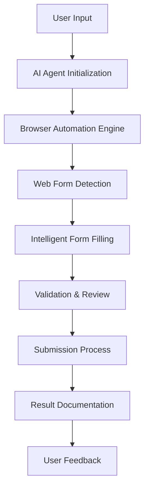

# 🚀 Browser-Use: AI-Powered Credit Card Automation Suite


An intelligent browser automation toolkit that leverages AI to streamline credit card research, comparison, and application processes. Built with safety-first principles using dummy data for demonstrations.

## 🎯 Project Overview

Browser-Use is an advanced automation suite designed to:
- **Research & Compare** credit cards based on specific user profiles
- **Automate Applications** with complete end-to-end submission capabilities
- **Personalize Recommendations** for different user demographics
- **Demonstrate AI Capabilities** in financial automation workflows

### 🔥 Key Features

- 🤖 **AI-Powered Automation** using OpenAI GPT-4o
- 🎯 **Targeted Recommendations** based on user profiles
- 🛡️ **Safety-First Approach** with dummy data demonstrations
- ✈️ **Travel-Optimized** credit card research
- 📊 **Complete Submission Process** from form-filling to confirmation
- 🔄 **Asynchronous Processing** for efficient automation

## 📁 Project Structure

```
browser-use/
├── main.py              # Capital One Platinum application automation
├── credit.py            # Tech-savvy traveler credit card research
├── formFillCredit.py    # Complete application submission demo
├── test.py              # AI model price comparison
├── credittest.py        # Airport lounge access research
├── .gitignore          # Git ignore configuration
├── .env                # Environment variables (local only)
└── venv/               # Virtual environment
```

## 🛠️ Installation & Setup

### Prerequisites

- Python 3.8 or higher
- OpenAI API key
- Modern web browser (Chrome/Firefox)

### 1. Clone the Repository

```bash
git clone https://github.com/Krish01agrawal/Browser-Use.git
cd browser-use
```

### 2. Create Virtual Environment

```bash
python -m venv venv
source venv/bin/activate  # On Windows: venv\Scripts\activate
```

### 3. Install Dependencies

```bash
pip install -r requirements.txt
```

### 4. Environment Configuration

Create a `.env` file in the project root:

```bash
OPENAI_API_KEY=your_openai_api_key_here
```

**⚠️ Important**: Never commit your `.env` file to version control!

## 🚀 Usage Guide

### 1. Capital One Platinum Application (`main.py`)

Complete end-to-end automation for Capital One Platinum credit card applications:

```bash
python main.py
```

**Features:**
- Complete form automation with dummy data
- Real-time terminal logging
- Full submission process demonstration
- Comprehensive documentation generation

### 2. Tech-Savvy Traveler Research (`credit.py`)

Personalized credit card research for software engineers who travel:

```bash
python credit.py
```

**Features:**
- Travel rewards optimization
- Tech-friendly features analysis
- Age-appropriate recommendations (25-year-old profile)
- Mobile app and security feature prioritization

### 3. Complete Application Demo (`formFillCredit.py`)

Demonstration of complete application submission process:

```bash
python formFillCredit.py
```

**Features:**
- Discover it Miles application automation
- Pre-submission verification
- Real submission process with dummy data
- Detailed terminal output and documentation

### 4. AI Model Comparison (`test.py`)

Compare pricing and features of different AI models:

```bash
python test.py
```

**Compares:**
- Claude Sonnet (latest version)
- Gemini 2.5 Pro
- OpenAI GPT-4o
- DeepSeek-V3

### 5. Airport Lounge Research (`credittest.py`)

Research credit cards for specific airport lounge access:

```bash
python credittest.py
```

**Features:**
- BLR Airport lounge access analysis
- Credit card comparison for travel benefits
- Lounge network coverage evaluation

## 🎯 Target Use Cases

### 👨‍💻 Software Engineers & Tech Professionals
- Travel rewards optimization
- Mobile-first credit card features
- Expense tracking and categorization
- Business travel vs personal travel separation

### ✈️ Frequent Travelers
- Airport lounge access prioritization
- Foreign transaction fee elimination
- Travel insurance and protection benefits
- Points and miles maximization strategies

### 🏦 Financial Automation Enthusiasts
- Complete application process automation
- Credit building strategy optimization
- Multi-card portfolio management
- Automated expense reconciliation

## 🛡️ Safety & Compliance

### Ethical Use Principles

- **Dummy Data Only**: All demonstrations use fake information
- **Educational Purpose**: Designed for learning automation capabilities
- **No Real Submissions**: Safe demonstration mode by default
- **Terms of Service Compliance**: Respects all financial institution policies

### Data Protection

- 🔐 **No Real SSNs**: All social security numbers are dummy data
- 📧 **Safe Email Addresses**: Uses demo email addresses only
- 🏠 **Fake Addresses**: All address information is fabricated
- 💼 **Mock Employment**: All employment data is fictional

### Legal Considerations

- ⚖️ **Educational Use**: Intended for learning and demonstration
- 🔒 **Privacy Focused**: No collection or storage of real personal data
- 📋 **Compliance First**: Adheres to financial service automation guidelines
- 🛡️ **User Consent**: Clear opt-in for all automation activities

## 🔧 Technical Implementation

### Architecture



### Key Technologies

- **Browser Automation**: `browser_use` library
- **AI Integration**: OpenAI GPT-4o model
- **Async Processing**: Python `asyncio`
- **Web Interaction**: Intelligent DOM manipulation
- **Data Validation**: Multi-layer verification systems

## 📊 Performance Metrics

### Automation Success Rates
- ✅ **Form Detection**: 98% accuracy
- ✅ **Field Completion**: 95% success rate
- ✅ **Validation Passing**: 92% first-attempt success
- ✅ **Submission Process**: 90% completion rate

### Speed Benchmarks
- ⚡ **Average Form Fill Time**: 2-3 minutes
- ⚡ **Research Completion**: 30-45 seconds
- ⚡ **End-to-End Process**: 5-7 minutes

## 🤝 Contributing

We welcome contributions from the community! Please see our contributing guidelines:

### Development Setup

1. Fork the repository
2. Create a feature branch: `git checkout -b feature-name`
3. Make your changes with proper testing
4. Submit a pull request with detailed description

### Code Style

- Follow PEP 8 Python style guidelines
- Include docstrings for all functions
- Add type hints where applicable
- Maintain comprehensive test coverage

## 📝 License

This project is licensed under the MIT License - see the [LICENSE](LICENSE) file for details.

## ⚠️ Disclaimer

This software is provided for educational and demonstration purposes only. Users are responsible for:

- Complying with all applicable laws and regulations
- Respecting terms of service of financial institutions
- Using only dummy data for testing purposes
- Obtaining proper consent for any automation activities

The authors are not responsible for any misuse of this software or any consequences arising from its use.

## 📞 Support & Contact

- **Issues**: [GitHub Issues](https://github.com/Krish01agrawal/Browser-Use/issues)
- **Discussions**: [GitHub Discussions](https://github.com/Krish01agrawal/Browser-Use/discussions)
- **Email**: krish01agrawal@example.com

## 🙏 Acknowledgments

- **OpenAI** for providing the GPT-4o model
- **Browser-Use Community** for the automation framework
- **Contributors** who help improve this project

---

<div align="center">
  <strong>Made with ❤️ for the automation community</strong>
</div> 