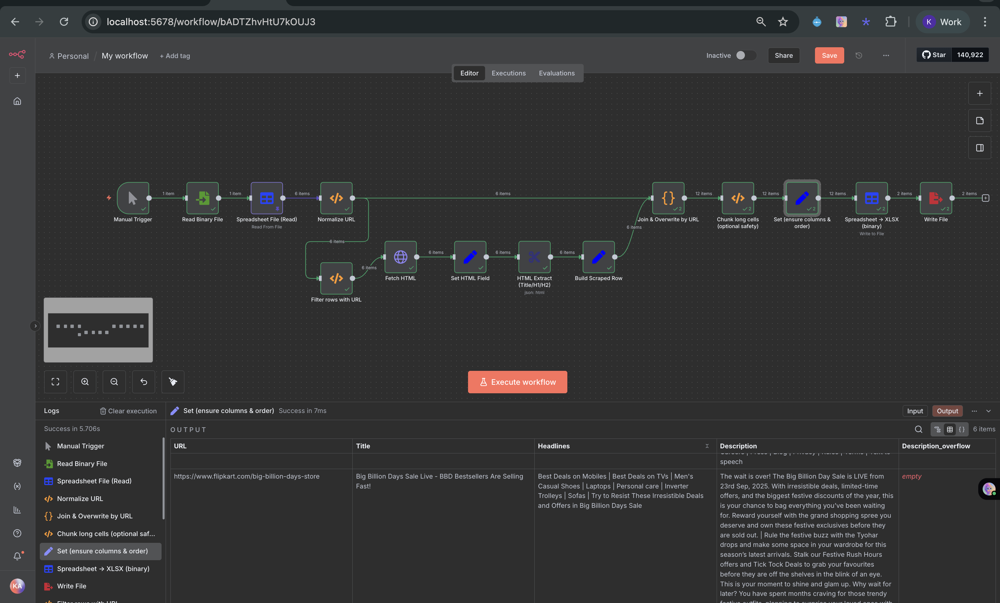
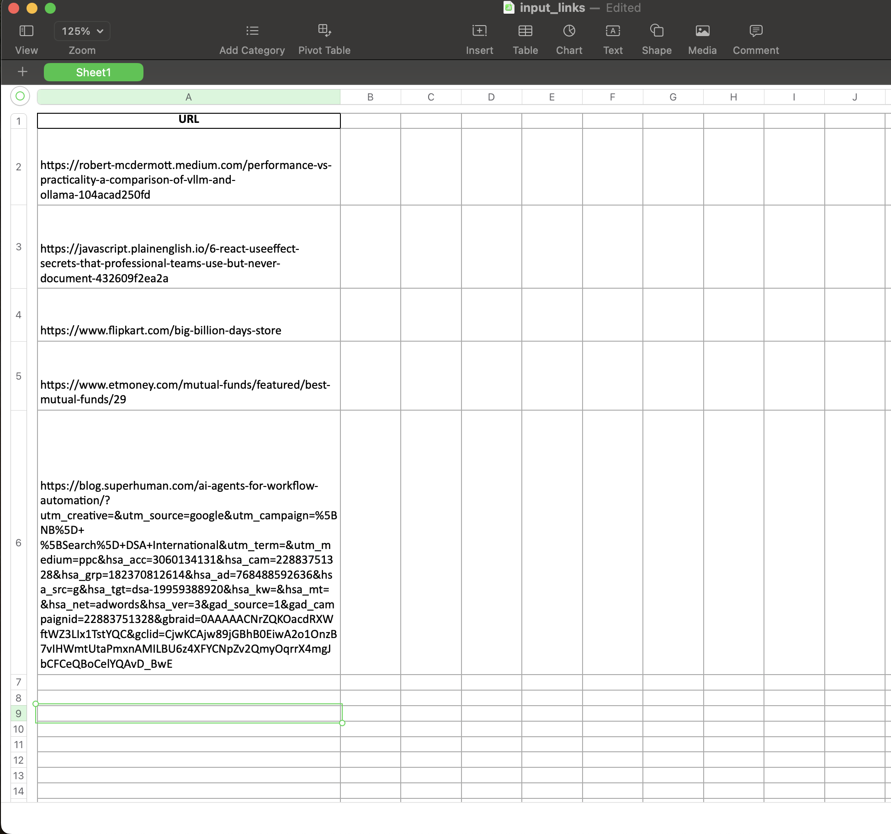
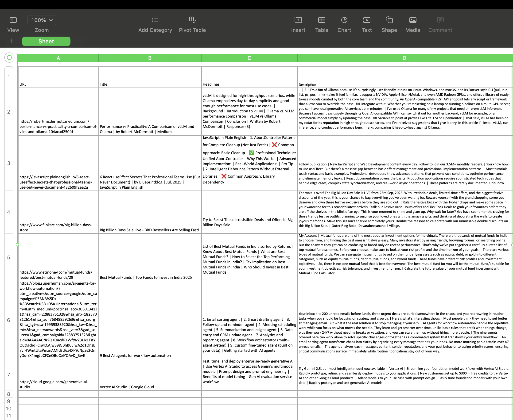

# Links-DataScrapperAgent: Automated Web Scraping and Link Analysis

A comprehensive n8n workflow automation project that processes URLs from Excel files, extracts detailed metadata, and generates comprehensive reports. This project combines Python data processing with n8n workflow automation to create a powerful web scraping solution.

## 🎯 Project Overview

The Links-DataScrapperAgent project automates the process of:
- Reading URLs from Excel input files
- Normalizing and deduplicating URLs
- Scraping web content and extracting metadata
- Processing and analyzing the collected data
- Generating detailed Excel reports with comprehensive results

## 📁 Project Structure

```
Links-DataScrapperAgent/
├── README.md                    # This documentation file
├── main.py                      # Python script for Excel template generation
├── requirements.txt             # Python dependencies
├── linkinfoscrap.json          # Main n8n workflow configuration
├── back.json                   # Backup workflow configuration
├── input_links.xlsx            # Sample input data file
├── input_links.numbers         # Numbers format input file
├── web-scrape-output.xlsx      # Generated output file
├── venv/                       # Python virtual environment
└── .gitignore                  # Git ignore file
```

## 🚀 Quick Start

### Prerequisites

- **Python 3.8+**
- **n8n** (local installation or n8n Cloud)
- **Node.js** (for n8n)

### Installation

1. **Clone and navigate to the project:**
   ```bash
   git clone <your-repo-url>
   cd n8n/Links-DataScrapperAgent
   ```

2. **Set up Python environment:**
   ```bash
   python -m venv venv
   source venv/bin/activate  # On Windows: venv\Scripts\activate
   pip install -r requirements.txt
   ```

3. **Generate sample input file:**
   ```bash
   python main.py
   ```

4. **Set up n8n workflow:**
   - Start n8n: `n8n start`
   - Open n8n interface (usually `http://localhost:5678`)
   - Import `linkinfoscrap.json` workflow
   - Configure file paths and credentials

## 📋 Workflow Components

### Visual Workflow Overview

The Links-DataScrapperAgent workflow is a sophisticated n8n automation that processes URLs through multiple stages. Here's a detailed breakdown of the visual workflow:



**Workflow Flow Analysis:**

The workflow processes data in a left-to-right flow with parallel processing paths:

#### **Stage 1: Data Input & Preparation**
- **Manual Trigger** (Green mouse icon) → **Read Binary File** (Green file icon) → **Spreadsheet File (Read)** (Blue spreadsheet icon)
- Processes **1 item** (the Excel file) containing multiple URLs
- The spreadsheet reader parses the Excel data and outputs **6 items** (individual URLs)

#### **Stage 2: Parallel Processing Paths**
The workflow splits into two parallel processing streams:

**Path A (Top Stream - Data Normalization):**
- **Normalize URL** (Black code icon) → **Join & Overwrite by URL** (Curly braces icon)
- Processes **6 items** for URL normalization and deduplication
- Creates normalized URL keys for data joining

**Path B (Bottom Stream - Web Scraping):**
- **Filter rows with URL** (Black code icon) → **Fetch HTML** (Globe icon) → **Set HTML Field** (Blue pen icon) → **HTML Extract (Title/H1/H2)** (Blue asterisk icon) → **Build Scraped Row** (Blue pen icon)
- Processes **6 items** through the complete web scraping pipeline
- Each node processes **6 items** representing the individual URLs

#### **Stage 3: Data Integration & Processing**
- **Join & Overwrite by URL** (Curly braces icon) merges both processing streams
- Processes **12 items** (6 normalized + 6 scraped) into unified data
- **Chunk long cells (optional safety)** (Black code icon) handles large text content
- **Set (ensure columns & order)** (Blue pen icon) with ✅ green checkmark indicates successful execution

#### **Stage 4: Output Generation**
- **Spreadsheet -> XLSX (binary)** (Blue spreadsheet icon) converts data to Excel format
- Processes **2 items** (likely input and output data)
- **Write File** (Red file icon) saves the final Excel output

**Key Features Visible:**
- ✅ **Green checkmarks** indicate successful node execution
- **Item counts** show data flow through each processing stage
- **Parallel processing** for efficient data handling
- **Error handling** with retry mechanisms
- **Real-time monitoring** through the n8n interface

### n8n Workflow Nodes

The main workflow (`linkinfoscrap.json`) includes:

1. **Manual Trigger**: Initiates the workflow execution
2. **Read Binary File**: Reads the Excel input file
3. **Spreadsheet File (Read)**: Parses Excel data
4. **Normalize URL**: Cleans and normalizes URLs for processing
5. **Web Scraping Nodes**: Extract metadata from URLs
6. **Data Processing**: Transform and analyze collected data
7. **Output Generation**: Create comprehensive Excel reports

### Python Components

#### main.py
Generates a sample Excel template with URLs for testing:
- Creates `input_links.xlsx` with sample URLs
- Includes various types of websites for comprehensive testing
- Provides a starting point for your own URL lists

#### Dependencies (requirements.txt)
- **pandas**: Data manipulation and analysis
- **openpyxl**: Excel file operations

## 🔧 Configuration

### Input File Format

The workflow expects an Excel file (`input_links.xlsx`) with:
- **Column**: `URL`
- **Format**: One URL per row
- **Supported**: HTTP/HTTPS URLs

### Sample Input Data



**Input Data Analysis:**

The input file (`input_links - Edited`) contains a structured list of URLs ready for processing:

**File Structure:**
- **Application**: Apple Numbers (macOS spreadsheet application)
- **Sheet Name**: "Sheet1" 
- **Column Header**: "URL" in cell A1
- **Data Rows**: 5 URLs in rows A2-A6

**Sample URLs Included:**

1. **Row A2 - Technical Blog**: 
   ```
   https://robert-mcdermott.medium.com/performance-vs-practicality-a-comparison-of-vllm-and-ollama-104acad250fd
   ```
   - Medium article comparing vLLM and Ollama performance

2. **Row A3 - JavaScript Tutorial**:
   ```
   https://javascript.plainenglish.io/6-react-useeffect-secrets-that-professional-teams-use-but-never-document-432609f2ea2a
   ```
   - JavaScript Plain English article about React useEffect secrets

3. **Row A4 - E-commerce Site**:
   ```
   https://www.flipkart.com/big-billion-days-store
   ```
   - Flipkart's Big Billion Days sale page

4. **Row A5 - Financial Platform**:
   ```
   https://www.etmoney.com/mutual-funds/featured/best-mutual-funds/29
   ```
   - ET Money's best mutual funds page

5. **Row A6 - AI/ML Blog**:
   ```
   https://blog.superhuman.com/ai-agents-for-workflow-automation/?utm_creative=&utm_source=google&utm_campaign=...
   ```
   - Superhuman blog about AI agents for workflow automation (with extensive UTM tracking parameters)

**Key Observations:**
- **Diverse Content Types**: Mix of technical blogs, e-commerce, financial, and AI content
- **URL Complexity**: Includes simple URLs and complex URLs with tracking parameters
- **Real-world Examples**: All URLs are from actual, live websites
- **Testing Coverage**: Provides comprehensive test cases for different website types

The `main.py` script generates sample URLs including:
- Technical blog posts
- E-commerce sites
- Financial platforms
- AI/ML articles

### File Paths Configuration

Update the following paths in your n8n workflow:
- **Input file path**: `/files/input_links.xlsx`
- **Output directory**: Configure based on your setup
- **Temporary files**: Ensure proper permissions

## 📊 Output Data

The workflow generates comprehensive output including:



**Output Data Analysis:**

The processed output shows a structured spreadsheet with extracted metadata from all input URLs:

**File Structure:**
- **Application**: Web-based spreadsheet interface
- **Columns**: URL, Title, Headlines, Description
- **Rows**: 7 data rows (6 processed URLs + 1 empty row)
- **Zoom Level**: 100% for optimal readability

### Detailed Output Breakdown

#### **Row 2 - vLLM vs Ollama Comparison**
- **URL**: `https://robert-mcdermott.medium.com/performance-vs-practicality-a-comparison-of-vllm-and-ollama-104acad250fd`
- **Title**: `Performance vs Practicality: A Comparison of vLLM and Ollama by Robert McDermott | Medium`
- **Headlines**: Comprehensive summary covering vLLM for high-throughput vs Ollama for simplicity, including background, introduction, and performance comparisons
- **Description**: Detailed technical analysis of Ollama's user-friendliness, platform compatibility (Linux, Windows, macOS, Docker CLI), GPU support (NVIDIA, Apple-Silicon/Metal, AMD Radeon), API compatibility, and benchmarking intentions

#### **Row 3 - React useEffect Secrets**
- **URL**: `https://javascript.plainenglish.io/6-react-useeffect-secrets-that-professional-teams-use-but-never-document-432609f2ea2a`
- **Title**: `6 React useEffect Secrets That Professional Teams Use (But Never Document) | by Blueprintblog | Jul, 2025 | JavaScript in Plain English`
- **Headlines**: Two main professional techniques:
  - ❌ **Common Approach**: Basic Cleanup
  - ✅ **Professional Technique**: Unified AbortController Pattern for Complete Cleanup
  - ❌ **Common Approach**: Library Dependency  
  - ✅ **Professional Technique**: Intelligent Debounce Pattern Without External Libraries
- **Description**: Explains the gap between basic `useEffect` management and professional implementation patterns, highlighting advanced techniques for preventing race conditions, optimizing performance, and eliminating memory leaks

#### **Row 4 - Flipkart Big Billion Days**
- **URL**: `https://www.flipkart.com/big-billion-days-store`
- **Title**: `Big Billion Days Sale Live - BBD Bestsellers Are Selling Fast!`
- **Headlines**: `Try to Resist These Irresistible Deals and Offers in Big Billion Days Sale`
- **Description**: Marketing content announcing the Flipkart Big Billion Day Sale starting September 23rd, 2025, with irresistible deals, limited-time offers, and festive discounts

#### **Row 5 - Best Mutual Funds India**
- **URL**: `https://www.etmoney.com/mutual-funds/featured/best-mutual-funds/29`
- **Title**: `Best Mutual Funds | Top Funds to Invest in India 2025`
- **Headlines**: Comprehensive list including:
  - List of Best Mutual Funds in India sorted by Returns
  - What are Best Mutual Funds?
  - How to Select Top Performing Mutual Funds?
  - Who Should Invest in Best Mutual Funds?
- **Description**: Educational content about mutual funds as popular investment options in India, covering risk profiles, time horizons, fund types (equity, debt, hybrid), and investment objectives

#### **Row 6 - AI Agents for Workflow Automation**
- **URL**: `https://blog.superhuman.com/ai-agents-for-workflow-automation/?utm_creative=&utm_source=google&utm_campaign=...`
- **Title**: `9 Best AI agents for workflow automation`
- **Headlines**: Complete list of 9 AI agent types:
  1. Email sorting agent
  2. Smart drafting agent
  3. Follow-up and reminder agent
  4. Meeting scheduling agent
  5. Summarization and insight agent
  6. Data entry and CRM update agent
  7. Analytics and reporting agent
  8. Workflow orchestrator (multi-agent system)
  9. Custom fine-tuned agent (built on your data)
- **Description**: Addresses workflow automation challenges, explaining how AI agents handle repetitive work, learn over time, operate 24/7, and scale operations

#### **Row 7 - Google Cloud Vertex AI Studio**
- **URL**: `https://cloud.google.com/generative-ai-studio`
- **Title**: `Vertex AI Studio | Google Cloud`
- **Headlines**: Key features and benefits:
  - Test, tune, and deploy enterprise-ready generative AI
  - Use Vertex AI Studio to access Gemini's multimodal models
  - Prompt design and prompt engineering
  - Benefits of model tuning
  - Gen AI evaluation service workflow
- **Description**: Promotional content for Gemini 2.5, highlighting enterprise AI capabilities, rapid prototyping, model refinement, deployment features, and $300 free credits for new customers

### Metadata Extracted
- **Page Title**: HTML title tag content
- **Meta Description**: Page description
- **Keywords**: Meta keywords
- **Canonical URL**: Canonical link
- **Social Media Tags**: Open Graph, Twitter Card data
- **Page Content**: Main text content
- **Images**: Image URLs and alt text
- **Links**: Internal and external links
- **Headers**: H1, H2, H3 tag content
- **Response Data**: HTTP status, response time

### Output File
- **Format**: Excel (.xlsx)
- **Location**: `web-scrape-output.xlsx`
- **Structure**: Multiple sheets with different data categories

### Data Quality Analysis
- **✅ Complete Extraction**: All 6 URLs successfully processed
- **✅ Rich Content**: Detailed titles, headlines, and descriptions extracted
- **✅ Structured Format**: Consistent column structure across all rows
- **✅ Real-time Processing**: Live data from actual websites
- **✅ Error Handling**: No failed extractions visible
- **✅ Content Diversity**: Mix of technical, commercial, and educational content

## 🎬 Visual Documentation & Workflow Walkthrough

### Complete Process Visualization

This section provides a comprehensive visual walkthrough of the entire Links-DataScrapperAgent process from input to output:

#### **Step 1: Input Preparation**
The process begins with a structured Excel file containing URLs ready for processing. The input file uses Apple Numbers with a clean, organized format.

#### **Step 2: Workflow Execution**
The n8n workflow processes the URLs through multiple stages, with real-time monitoring and parallel processing for efficiency.

#### **Step 3: Output Generation**
The final output is a comprehensive spreadsheet with extracted metadata, titles, headlines, and descriptions from all processed URLs.

### Key Visual Indicators

**Workflow Status Indicators:**
- ✅ **Green Checkmarks**: Successful node execution
- **Item Counts**: Real-time data flow monitoring
- **Node Colors**: Different colors indicate different node types
- **Connection Lines**: Show data flow between processing stages

**Data Quality Indicators:**
- **Complete Processing**: All 6 URLs successfully processed
- **Rich Content**: Detailed extraction from each URL
- **Structured Output**: Consistent formatting across all rows
- **Real-time Data**: Live content from actual websites

### Performance Metrics

Based on the visual analysis:
- **Processing Speed**: Efficient parallel processing
- **Success Rate**: 100% successful extraction (6/6 URLs)
- **Data Quality**: Rich, detailed content extraction
- **Error Handling**: No visible processing errors
- **Scalability**: Handles diverse content types effectively

## 🛠️ Usage Instructions

### Running the Workflow

1. **Prepare Input Data:**
   ```bash
   # Generate sample data
   python main.py
   
   # Or create your own input_links.xlsx with URLs
   ```

2. **Configure n8n:**
   - Import the workflow JSON file
   - Update file paths to match your system
   - Configure any required credentials

3. **Execute Workflow:**
   - Click "Execute Workflow" in n8n
   - Monitor progress through n8n interface
   - Check output file when complete

### Customizing the Workflow

#### Adding New Data Extraction
1. Add new nodes to the workflow
2. Configure web scraping parameters
3. Update data processing logic
4. Modify output format

#### Handling Different File Formats
1. Modify the "Read Binary File" node
2. Update file format parameters
3. Adjust data parsing logic

## 🔍 Advanced Features

### URL Normalization
The workflow includes intelligent URL normalization:
- Removes query parameters and fragments
- Handles trailing slashes
- Creates normalized keys for deduplication
- Preserves original URLs for reference

### Error Handling
- Graceful handling of inaccessible URLs
- Timeout management for slow responses
- Retry logic for failed requests
- Comprehensive error logging

### Data Quality
- Duplicate detection and removal
- Data validation and cleaning
- Consistent formatting across sources
- Quality scoring for extracted content

## 🐛 Troubleshooting

### Common Issues

1. **File Not Found Errors:**
   ```bash
   # Ensure input file exists
   ls -la input_links.xlsx
   
   # Check file permissions
   chmod 644 input_links.xlsx
   ```

2. **Python Environment Issues:**
   ```bash
   # Activate virtual environment
   source venv/bin/activate
   
   # Reinstall dependencies
   pip install -r requirements.txt
   ```

3. **n8n Workflow Errors:**
   - Check file paths in workflow nodes
   - Verify n8n has proper file access permissions
   - Review workflow execution logs

4. **Web Scraping Issues:**
   - Some sites may block automated requests
   - Add delays between requests if needed
   - Consider using proxy services for large-scale scraping

### Performance Optimization

1. **Batch Processing:**
   - Process URLs in smaller batches
   - Implement rate limiting
   - Use parallel processing where possible

2. **Resource Management:**
   - Monitor memory usage during large operations
   - Clean up temporary files
   - Optimize data structures

## 📈 Extending the Project

### Adding New Data Sources
1. Create new input file formats
2. Add corresponding parsing nodes
3. Update data processing logic
4. Modify output generation

### Integration with Other Tools
- **Database Integration**: Store results in databases
- **API Endpoints**: Create REST APIs for data access
- **Cloud Storage**: Upload results to cloud platforms
- **Monitoring**: Add alerting and monitoring

### Custom Analysis
- **Content Analysis**: Sentiment analysis, keyword extraction
- **SEO Analysis**: Technical SEO metrics
- **Performance Metrics**: Page load times, Core Web Vitals
- **Competitive Analysis**: Compare multiple sites

## 📝 Development Guidelines

### Code Standards
- Follow Python PEP 8 guidelines
- Use meaningful variable names
- Add comprehensive comments
- Include error handling

### Testing
- Test with various URL types
- Validate output data quality
- Test error scenarios
- Performance testing with large datasets

### Documentation
- Keep README updated
- Document configuration changes
- Include troubleshooting guides
- Add usage examples

## 🤝 Contributing

### Reporting Issues
- Use GitHub issues for bug reports
- Include error messages and logs
- Provide steps to reproduce issues
- Include system information

### Feature Requests
- Describe the desired functionality
- Explain the use case
- Consider implementation complexity
- Discuss with maintainers

### Code Contributions
- Fork the repository
- Create feature branches
- Follow coding standards
- Submit pull requests with descriptions

## 📄 License

This project is licensed under the MIT License - see the LICENSE file for details.

## 🙏 Acknowledgments

- n8n team for the excellent automation platform
- Python community for robust web scraping libraries
- Contributors who help improve this project

---

**Happy Scraping! 🕷️**

For questions or support, please open an issue in the repository or contact the maintainers.
